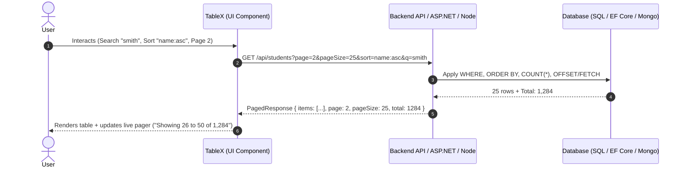

<div align="center">

# ⚡ TableX

### **A professional, server-driven data grid for React, Next.js, Angular, vanilla JavaScript, and ASP.NET Core.**

One Engine · One Stylesheet · One Server Contract · Four Frameworks

[](LICENSE)
[](https://www.npmjs.com/package/@tablex/react)
[](https://www.nuget.org/packages/TableX.AspNetCore)
[](https://www.typescriptlang.org/)
[](packages/core/test)
[](CONTRIBUTING.md)

[**Explore Documentation**](docs/README.md) · [**View Examples**](examples/README.md) · [**Getting Started**](docs/getting-started.md) · [**Changelog**](CHANGELOG.md)

</div>

---

## 🚀 Why TableX?

Traditional data grids assume the browser can hold your entire dataset in memory. That works fine for 100 rows, but breaks down when datasets scale:
- Sorting silently re-orders **only the current page**, showing incorrect rankings.
- Search filters only what is already downloaded in memory.
- Exporting writes out only the visible DOM rows instead of the full filtered dataset.

**TableX is designed server-driven from the core.**

The grid **never holds your entire dataset**. Every user interaction — paging, multi-column sorting, global search, column filters — compiles into a standard [`QueryState`](docs/concepts.md#the-querystate-contract) object. Your server responds with exactly **one page of records plus the total matching count**.

This single architectural rule ensures TableX behaves with identical lightning-fast performance at **50 rows or 5,000,000 rows**.



---

## 📦 Packages

| Package | Target Platform | Installation |
| :--- | :--- | :--- |
| [`@tablex/core`](packages/core) | Framework-agnostic engine, contracts, math, theme | `npm install @tablex/core` |
| [`@tablex/react`](packages/react) | React 18+, React 19, Next.js (App Router) | `npm install @tablex/react` |
| [`@tablex/angular`](packages/angular) | Angular 17+, Angular 18, Angular 19 | `npm install @tablex/angular` |
| [`@tablex/vanilla`](packages/vanilla) | Zero-dependency DOM renderer / IIFE Global | `npm install @tablex/vanilla` |
| [`TableX.AspNetCore`](dotnet/TableX.AspNetCore) | ASP.NET Core 8+ Razor Class Library & TagHelpers | `dotnet add package TableX.AspNetCore` |

---

## ✨ Features

Every feature works identically across React, Angular, Vanilla JS, and ASP.NET Core:

- ⚡ **Server-Driven Query Engine** — Pagination, sorting, global search, and filters are server requests, never client-side array mutations.
- 🔍 **Debounced Global Search** — 350 ms debounced search with automatic clear button.
- 🔄 **Three-State Sorting** — Familiar cycle: `Ascending → Descending → Cleared`. Multi-column sorting supported.
- 📄 **Numbered Pagination & Jump** — Smart ellipsis, page size selector (`10, 25, 50, 100`), jump-to-page input, and live range summary (`Showing 21 to 40 of 1,284 entries`).
- ☑️ **Row Selection** — Single and multi-row selection with "Select All on Page" checkbox and active selection badge.
- 👁️ **Column Visibility & Alignment** — Dropdown menu to toggle column visibility on the fly; custom left/center/right alignment.
- 📏 **Density Switching** — Compact (36px), Standard (44px), and Comfortable (52px) row height modes.
- 🔢 **Automatic Serial Numbers** — Built-in `S.No.` column that seamlessly counts across pages.
- 📊 **Multi-Format Exports** —
  - **Formatted Excel (.xls)** with automatic status badge styling and colored cell tags.
  - **RFC 4180 CSV** with UTF-8 BOM.
  - Full-dataset export support (fetches all filtered pages in the background, not just on-screen rows).
  - OWASP spreadsheet-injection neutralization (formula protection).
- 📱 **Mobile Card Responsive Layout** — Renders as a structured table on desktop; automatically switches to high-density cards below 768px.
- 🎨 **Modern Theming & Dark Mode** — Clean CSS custom properties (`--tbx-*`), with built-in Light, Dark, and OS-matched Auto themes.
- 🌐 **100% Localizable** — Every string and label is overridable via [`TableXLocale`](docs/localization.md).
- ♿ **Accessible & Safe** — Semantic table markup, full ARIA attributes (`aria-sort`, `role="region"`), keyboard operable, and strict XSS protection.

---

## ⚡ Quick Start

### 1. React / Next.js (App Router Safe)

```bash
npm install @tablex/react @tablex/core
```

```tsx
"use client";

import { useEffect, useState } from "react";
import { TableX } from "@tablex/react";
import {
  defaultQuery,
  buildQueryUrl,
  type QueryState,
  type PagedResponse,
  type TableXColumn,
} from "@tablex/core";
import "@tablex/react/styles.css";

interface Student {
  id: string;
  name: string;
  email: string;
  status: string;
}

const columns: TableXColumn<Student, React.ReactNode>[] = [
  { accessorKey: "name", header: "Name" },
  { accessorKey: "email", header: "Email" },
  {
    accessorKey: "status",
    header: "Status",
    cell: ({ getValue }) => <span className="badge">{String(getValue())}</span>,
  },
];

export function StudentsGrid() {
  const [query, setQuery] = useState<QueryState>(defaultQuery());
  const [page, setPage] = useState<PagedResponse<Student>>();
  const [loading, setLoading] = useState(true);

  useEffect(() => {
    setLoading(true);
    fetch(buildQueryUrl("/api/students", query))
      .then((r) => r.json())
      .then(setPage)
      .finally(() => setLoading(false));
  }, [query]);

  return (
    <TableX
      caption="Students Directory"
      columns={columns}
      data={page?.items ?? []}
      total={page?.total ?? 0}
      query={query}
      onQueryChange={setQuery}
      isLoading={loading}
      enableSelection
      fetchEndpoint="/api/students"
    />
  );
}
```

---

### 2. Angular (17+ Standalone)

```bash
npm install @tablex/angular @tablex/core
```

```typescript
import { Component, signal } from '@angular/core';
import { TableXComponent, type TableXColumn } from '@tablex/angular';
import { defaultQuery, buildQueryUrl, type QueryState, type PagedResponse } from '@tablex/core';

@Component({
  selector: 'app-students-grid',
  standalone: true,
  imports: [TableXComponent],
  template: `
    <table-x
      caption="Students Directory"
      [columns]="columns"
      [data]="data()"
      [total]="total()"
      [query]="query()"
      [isLoading]="loading()"
      [enableSelection]="true"
      fetchEndpoint="/api/students"
      (queryChange)="onQueryChange($event)"
    />
  `,
})
export class StudentsGridComponent {
  query = signal<QueryState>(defaultQuery());
  data = signal<Student[]>([]);
  total = signal(0);
  loading = signal(false);

  columns: TableXColumn<Student>[] = [
    { accessorKey: 'name', header: 'Name' },
    { accessorKey: 'email', header: 'Email' },
    { accessorKey: 'status', header: 'Status' },
  ];

  onQueryChange(next: QueryState) {
    this.query.set(next);
    this.loading.set(true);
    fetch(buildQueryUrl('/api/students', next))
      .then((r) => r.json())
      .then((res: PagedResponse<Student>) => {
        this.data.set(res.items);
        this.total.set(res.total);
      })
      .finally(() => this.loading.set(false));
  }
}
```

---

### 3. ASP.NET Core (Razor Tag Helpers + EF Core)

```bash
dotnet add package TableX.AspNetCore
```

**Controller / Minimal API Endpoint:**
```csharp
[HttpGet("/api/students")]
public async Task<PagedResponse<Student>> Get([FromQuery] TableXQuery query, AppDbContext db)
{
    return await db.Students
        .AsNoTracking()
        .ToPagedResponseAsync(query, options => options
            .Sortable(s => s.Name, s => s.CreatedAt)
            .Searchable(s => s.Name, s => s.Email)
            .Filterable("status", s => s.Status)
            .DefaultSort(s => s.CreatedAt, SortDirection.Descending));
}
```

**Razor View (`.cshtml`):**
```cshtml
@using TableX.AspNetCore
@addTagHelper *, TableX.AspNetCore

<link rel="stylesheet" href="@TableXAssets.StylesheetPath" />
<script src="@TableXAssets.ScriptPath"></script>

<table-x caption="Students Directory" endpoint="/api/students" enable-selection="true">
    <table-x-column field="name" header="Name" min-width="180" />
    <table-x-column field="email" header="Email" />
    <table-x-column field="status" header="Status" align="Center" />
</table-x>
```

---

### 4. Vanilla JavaScript / Plain HTML

```html
<link rel="stylesheet" href="https://cdn.jsdelivr.net/npm/@tablex/vanilla/dist/tablex.css" />
<script src="https://cdn.jsdelivr.net/npm/@tablex/vanilla/dist/tablex.global.js"></script>

<div id="grid"></div>

<script>
  const grid = TableX.createTableX(document.getElementById("grid"), {
    caption: "Students Directory",
    endpoint: "/api/students",
    enableSelection: true,
    columns: [
      { accessorKey: "name", header: "Name" },
      { accessorKey: "email", header: "Email" },
      { accessorKey: "status", header: "Status" },
    ],
  });
</script>
```

---

## 📡 The Wire Contract

The entire communication between client and server rests upon two simple, standardized structures:

### 1. Request Query String
```http
GET /api/students?page=2&pageSize=25&sort=name:asc&q=smith&filter[status]=Active
```

### 2. JSON Response
```jsonc
{
  "items": [
    { "id": 101, "name": "Aditi Sharma", "email": "aditi@example.edu", "status": "Active" }
    /* ... exactly 25 items for page 2 ... */
  ],
  "page": 2,
  "pageSize": 25,
  "total": 1284,       // Full count matching search & filters (drives pager)
  "totalPages": 52
}
```

---

## 📚 Documentation Index

| Guide | Description |
| :--- | :--- |
| 📖 [**Getting Started**](docs/getting-started.md) | Setup and first working grid in React, Next.js, Angular, ASP.NET Core, and Vanilla JS. |
| 💡 [**Core Concepts**](docs/concepts.md) | Deep dive into the server-driven model, `QueryState`, and state reducers. |
| 📐 [**Column Configuration**](docs/columns.md) | Alignment, custom cell renderers, min/max widths, visibility, and sorting options. |
| 🎨 [**Theming & Styling**](docs/theming.md) | CSS custom property tokens (`--tbx-*`), Dark mode, and custom presets. |
| 🌍 [**Localization**](docs/localization.md) | Overriding strings, RTL considerations, and internationalized messages. |
| 🖥️ [**Server Integration**](docs/server-integration.md) | Implementing endpoints in ASP.NET Core, Node.js/Express, Next.js Route Handlers. |
| 🔀 [**Migrating from TanStack Table**](docs/migration-from-tanstack.md) | Direct comparison and drop-in migration from TanStack Table v8. |
| ❓ [**Frequently Asked Questions (FAQ)**](docs/faq.md) | Common questions, performance tips, and troubleshooting. |
| 📜 [**API Reference**](docs/api/core.md) | Complete prop and type documentation for all packages. |

---

## 💻 Runnable Example Projects

Explore ready-to-run projects inside the [`examples/`](examples/README.md) directory:

- ⚛️ [`examples/react-vite`](examples/react-vite) — React 19 + Vite + TypeScript
- ▲ [`examples/nextjs`](examples/nextjs) — Next.js 15 App Router + Server Route Handlers
- 🅰️ [`examples/angular`](examples/angular) — Angular 19 Standalone Components
- 🔷 [`examples/aspnet-mvc`](examples/aspnet-mvc) — ASP.NET Core 8 MVC + Razor Tag Helpers
- 🌐 [`examples/vanilla-html`](examples/vanilla-html) — Single-file standalone HTML + JS

---

## 🛠️ Building From Source

```bash
# Clone the repository
git clone https://github.com/ChhaganSinha/TableX.git
cd TableX

# Install dependencies and build all JS packages
npm install
npm run build
npm run test

# Build and pack ASP.NET Core library
dotnet build dotnet/TableX.sln -c Release
dotnet pack dotnet/TableX.AspNetCore/TableX.AspNetCore.csproj -c Release
```

---

## 👨‍💻 Author & Maintainer

**Chhagan Sinha**  
- 📧 Contact: [sinhachhagan@outlook.com](mailto:sinhachhagan@outlook.com)  
- 🐙 GitHub: [@ChhaganSinha](https://github.com/ChhaganSinha)

---

## 🤝 Contributing

Contributions are welcome! Please check out [CONTRIBUTING.md](CONTRIBUTING.md) for development workflows, coding guidelines, and [CODE_OF_CONDUCT.md](CODE_OF_CONDUCT.md).

For security reports, please refer to [SECURITY.md](SECURITY.md).

---

## 📄 License

TableX is open source software created by **Chhagan Sinha** and licensed under the [MIT License](LICENSE). Free for personal and commercial use forever.

