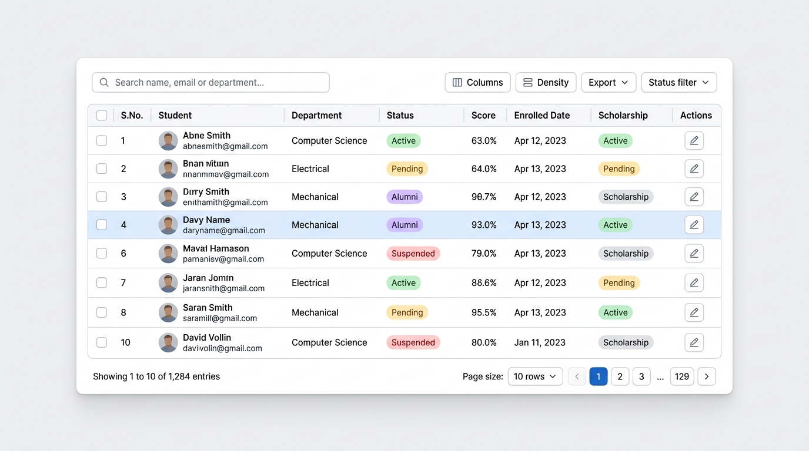

# 📖 TableX Documentation

Welcome to the official documentation for **TableX** — the server-driven data grid for React, Next.js, Angular, Vanilla JavaScript, and ASP.NET Core.

<p align="center">
  
</p>

---

## 🧭 Navigation Guide

```
docs/
├── concepts.md                 # Server-driven architecture & data flow
├── getting-started.md          # Step-by-step guides for all 4 frameworks
├── columns.md                  # Column definitions, widths, alignment, custom cells
├── theming.md                  # CSS custom properties, dark mode, color presets
├── localization.md             # Custom strings, translations, RTL support
├── server-integration.md       # Implementing endpoints in ASP.NET Core, Node, Next.js
├── migration-from-tanstack.md  # Migrating from TanStack Table v8
├── faq.md                      # Common questions and troubleshooting
├── adapter-spec.md             # Normative DOM & behavior contract for adapters
├── features/                   # Deep dives into grid capabilities
│   ├── search.md               # Debounced search & highlight
│   ├── sorting.md              # 3-state sorting & multi-sort
│   ├── pagination.md           # Numbered pager, range calculation, jump box
│   ├── selection.md            # Checkboxes, select-all, action badges
│   ├── column-filters.md       # 3-dot column filter popovers & range inputs
│   ├── pinned-columns.md       # Freeze/pin columns left & right with shadow
│   ├── bulk-actions.md         # Floating bottom pill bar for batch operations
│   ├── row-expansion.md        # Accordion master-detail expandable sub-rows
│   ├── summary-row.md          # Total, average, count, min/max footer row
│   ├── inline-editing.md       # Double-click cell editing with keyboard controls
│   ├── density.md              # Compact, default, comfortable presets
│   ├── export.md               # Excel (.xls) & CSV full-dataset exports
│   └── responsive.md           # Desktop table to mobile card layout
└── api/                        # API & Prop References
    ├── core.md                 # @nexgrid/core
    ├── react.md                # @nexgrid/react
    ├── angular.md              # @nexgrid/angular
    ├── vanilla.md              # @nexgrid/vanilla
    └── aspnet.md               # TableX.AspNetCore
```

---

## 📚 Core Guides

| Guide | Description |
| :--- | :--- |
| 🚀 [**Getting Started**](getting-started.md) | Installation and first working grid in React, Next.js, Angular, ASP.NET Core, and Vanilla HTML. |
| 💡 [**Core Concepts**](concepts.md) | Why TableX never holds your dataset, the `QueryState` / `PagedResponse` contract, and data flow. |
| 📐 [**Columns & Custom Cells**](columns.md) | Header names, accessor keys, custom cell templates (JSX, Angular templates, DOM nodes), alignment, and width. |
| 🎨 [**Theming & Styling**](theming.md) | CSS custom properties (`--tbx-*`), Dark mode, high-contrast themes, and customization. |
| 🌍 [**Localization**](localization.md) | Complete `TableXLocale` interface, translating buttons, placeholders, and range text. |
| 🖥️ [**Server Integration**](server-integration.md) | Wire format specifications with sample backends (ASP.NET Core EF Core, Node.js/Express, Next.js API Routes). |
| 🔀 [**Migrating from TanStack Table**](migration-from-tanstack.md) | Step-by-step migration guide for projects using `@tanstack/react-table`. |
| ❓ [**Frequently Asked Questions (FAQ)**](faq.md) | Answers to architectural, export, security, and performance questions. |

---

## ⚡ Feature Deep Dives

Every feature in TableX behaves with 100% parity across all platforms:

| Feature | Topics Covered |
| :--- | :--- |
| 🔍 [**Global Search**](features/search.md) | 350ms debouncing, clear button, custom search fields, and server translation. |
| 🔄 [**Sorting**](features/sorting.md) | Three-state sort cycle (`asc → desc → clear`), multi-column sort tokens, and server allowlists. |
| 📄 [**Pagination**](features/pagination.md) | Page size allowlists, smart ellipsis calculations, "Go to page" jump input, live record count. |
| ☑️ [**Row Selection**](features/selection.md) | Row identity keys, select-all-on-page header checkbox, selection badge, and selection modes. |
| 🔍 [**Column Filters**](features/column-filters.md) | 3-dot column filter popover (⋮), select lists, and numeric & date `min..max` range inputs. |
| 📌 [**Pinned Columns**](features/pinned-columns.md) | Freeze columns left/right with scroll elevation divider shadows. |
| ⚡ [**Bulk Actions Bar**](features/bulk-actions.md) | Floating bottom pill bar with item count, Excel/CSV export, and custom batch actions. |
| 📂 [**Row Expansion**](features/row-expansion.md) | Accordion master-detail sub-rows with animated rotating chevrons `[ ❯ ]`. |
| 🧮 [**Summary Row**](features/summary-row.md) | Bottom `<tfoot>` row calculating `sum`, `avg`, `count`, `min`, `max`, or custom aggregations. |
| ✏️ [**Inline Cell Editing**](features/inline-editing.md) | Double-click cell editing with text/number inputs or dropdowns, <kbd>Enter</kbd> to save, <kbd>Esc</kbd> to cancel. |
| 📏 [**Row Density**](features/density.md) | `compact` (36px), `default` (44px), and `comfortable` (52px) row height modes. |
| 📊 [**Excel & CSV Exports**](features/export.md) | Formatted Excel (.xlsx/.xls) with badges, RFC 4180 CSV with UTF-8 BOM, and full-dataset collector. |
| 📱 [**Responsive Card View**](features/responsive.md) | Seamless transformation from table (desktop) to cards (screens < 768px). |

---

## 📜 Package API References

| Package | Documentation |
| :--- | :--- |
| [`@nexgrid/core`](api/core.md) | Engine: types, query reducers, pagination math, URL query serializer, export engine. |
| [`@nexgrid/react`](api/react.md) | `<TableX />` props, hooks, and types. |
| [`@nexgrid/angular`](api/angular.md) | `<table-x>` inputs, outputs, `*tableXCell`, and `*tableXToolbar` directives. |
| [`@nexgrid/vanilla`](api/vanilla.md) | `createTableX()` options, event handlers, and handle methods. |
| [`TableX.AspNetCore`](api/aspnet.md) | `<table-x>` Tag Helpers, `TableXQuery` model binder, and EF Core `IQueryable` extensions. |

---

## 🤝 Specification & Compliance

Building a custom renderer or extending TableX? Review [`adapter-spec.md`](adapter-spec.md) for the normative DOM, accessibility, and behavioral specifications required of any TableX adapter.

---

## 👨‍💻 Author & Maintainer

**Chhagan Sinha**  
- 📧 Contact: [sinhachhagan@outlook.com](mailto:sinhachhagan@outlook.com)  
- 🐙 GitHub: [@ChhaganSinha](https://github.com/ChhaganSinha)

