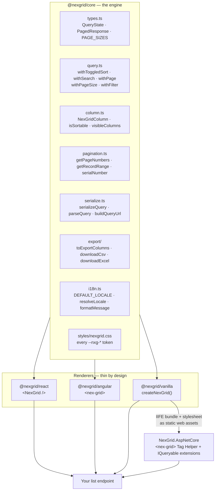

# Concepts

Everything in NexGrid follows from one decision: **the grid never holds your
dataset**. This page explains what that buys you, the two types the whole
library rests on, and the exact path a keystroke takes to become a rendered
page of rows.

- [The server-driven model](#the-server-driven-model)
- [Architecture](#architecture)
- [The contract: `QueryState` and `PagedResponse`](#the-contract-querystate-and-pagedresponse)
- [Data flow](#data-flow)
- [Why there is no client-side sorting](#why-there-is-no-client-side-sorting)
- [The reducers are the API](#the-reducers-are-the-api)
- [Controlled vs. endpoint mode](#controlled-vs-endpoint-mode)

## The server-driven model

A conventional grid takes an array and does the work in the browser: sort the
array, filter the array, slice a page out of it. That works until the array is
too big to send, at which point most grids do not fail loudly — they quietly
change meaning. "Sort by name" sorts the 25 rows on screen. "Search" filters
what happens to be in memory. The export writes out the page the user could
already see.

NexGrid inverts it. The grid holds:

- **one page of rows** (`data`)
- **the total filtered count** (`total`)
- **the query those two answer** (`query`)

and nothing else. When the user clicks a header, the grid does not reorder
anything; it computes the next `QueryState` and hands it to you. You fetch. You
hand back the next page. The grid re-renders.

The consequences are worth stating plainly:

| | |
| --- | --- |
| Sorting is a `ORDER BY` on the server | so it orders the whole result set, not the visible page |
| Search is a `WHERE` on the server | so `total` and the pager stay truthful |
| Paging is `OFFSET`/`FETCH` | so memory is O(pageSize), not O(rows) |
| Export can page the dataset in | so a "download everything" is honest — see [Export](features/export.md) |
| The grid has no data layer | so it works with REST, GraphQL, gRPC-web, a websocket feed, or an in-memory store |

## Architecture



An adapter contributes markup, event wiring and framework idiom. It contributes
**no** behavior: every query mutation goes through a core reducer, every string
through the locale, every pager button through `getPageNumbers`. That is what
keeps four renderers from drifting into four products.

## The contract: `QueryState` and `PagedResponse`

These two types are the entire integration surface. Implement them and any
NexGrid adapter works against your API with no glue code.

```ts
// From @nexgrid/core
export const PAGE_SIZES = [10, 25, 50, 100] as const;
export type PageSize = (typeof PAGE_SIZES)[number];

export type SortDir = "asc" | "desc";

export interface SortSpec {
  field: string;
  dir: SortDir;
}

/** The full client -> server intent. */
export interface QueryState {
  /** 1-based page number (>= 1). */
  page: number;
  /** Rows per page, constrained to PAGE_SIZES. */
  pageSize: PageSize;
  /** Ordered list of column sorts (first = primary). */
  sort: SortSpec[];
  /** Optional global search string. */
  q?: string;
  /** Optional per-column filters (`filter[<field>]=<value>`). */
  filter?: Record<string, string>;
}

/** The server -> client response every list endpoint must satisfy. */
export interface PagedResponse<T> {
  items: T[];
  page: number;
  pageSize: number;
  total: number;
  totalPages: number;
}
```

`total` is the **full filtered count**, not `items.length`. It is what drives
the pager, the "Showing 21 to 40 of 1,284 entries" range, and the export's
decision about whether it already has everything. Returning `items.length`
there is the single most common integration bug.

On the wire, a `QueryState` is a query string:

```text
GET /api/students?page=2&pageSize=25&sort=name:asc&q=smith&filter[status]=Active
```

```json
{ "items": [], "page": 2, "pageSize": 25, "total": 1284, "totalPages": 52 }
```

The full parameter table, including how malformed values degrade, is in
[Server integration](server-integration.md).

## Data flow

One click, end to end. This is a controlled grid (React, Angular, or vanilla
without an `endpoint`):

```mermaid
sequenceDiagram
    autonumber
    actor User
    participant Grid as NexGrid adapter
    participant Core as "@nexgrid/core"
    participant Host as Your component
    participant API as Your endpoint

    User->>Grid: clicks the "Name" header
    Grid->>Core: withToggledSort(query, "name")
    Core-->>Grid: { ...query, sort: [{field:"name",dir:"asc"}], page: 1 }
    Note over Core: sort cycles asc → desc → cleared;<br/>anything that changes which rows<br/>match resets to page 1
    Grid->>Host: onQueryChange(next)
    Host->>Host: setState(next), isLoading = true
    Host->>Core: buildQueryUrl("/api/students", next)
    Core-->>Host: /api/students?page=1&pageSize=25&sort=name:asc
    Host->>API: GET
    API-->>Host: PagedResponse&lt;Student&gt;
    Host->>Grid: data = items, total = total, query = next, isLoading = false
    Grid->>Core: getRecordRange · getPageNumbers · serialNumber
    Core-->>Grid: footer + pager model
    Grid-->>User: re-rendered page, aria-sort="ascending"
```

The grid is a pure function of `(columns, data, total, query)` plus its own
local UI state (which menu is open, which columns are hidden, the current
density, the selected ids). It never moves on its own.

The one exception is the export path, which needs rows the current page does
not have — see [Export](features/export.md).

## Why there is no client-side sorting

It is a deliberate omission, not a missing feature.

**A client-side sort is a lie about scope.** With 40,000 matching rows and 25 on
screen, "sort by name descending" done in the browser produces the alphabetically
last 25 rows *of page one*, presented in the same UI as a real sort. Nothing in
the interface tells the user which one they got. A server sort of the same
button always means the same thing.

**It cannot be made consistent with the pager.** The footer says "Showing 1 to
25 of 1,284". A local sort reorders 25 of those 1,284 and leaves the sentence
standing. Page 2 then comes back in server order and the two pages interleave
incorrectly.

**It cannot be made consistent with export.** An export that walked pages would
collect them in server order while the screen shows browser order — the file and
the screen disagree, and the user has no way to see it.

**Collation is the server's job anyway.** `ORDER BY` under a database collation
is not `Array.prototype.sort` with `String.localeCompare`. Accents, case,
culture-specific ordering, and `NULL` placement all differ. Sorting in two places
guarantees two answers.

So the grid ships one sort: the server's. `enableSorting: false` on a column
turns the header affordance off for columns your endpoint cannot order by — see
[Sorting](features/sorting.md).

The same reasoning applies to search and filters. `q` and `filter[...]` go to the
server; nothing is hidden locally, so `total` is always the count of rows that
actually match.

## The reducers are the API

`QueryState` is a plain object, so nothing stops you writing
`{ ...query, page: 4 }`. Do not. The reducers in `@nexgrid/core` are where the
cross-platform behavior lives:

```ts
import {
  defaultQuery,
  withToggledSort,
  withSearch,
  withPage,
  withPageSize,
  withFilter,
  totalPagesFor,
  type QueryState,
} from "@nexgrid/core";

let query: QueryState = defaultQuery();
// { page: 1, pageSize: 10, sort: [] }

query = withToggledSort(query, "name");   // sort asc,  page -> 1
query = withToggledSort(query, "name");   // sort desc, page -> 1
query = withToggledSort(query, "name");   // sort cleared, page -> 1

query = withSearch(query, "smith");       // q = "smith", page -> 1
query = withSearch(query, "");            // q removed entirely, page -> 1

query = withPageSize(query, 25);          // page -> 1
query = withPageSize(query, 7);           // ignored: 7 is not in PAGE_SIZES

query = withFilter(query, "status", "Active");   // filter[status], page -> 1
query = withFilter(query, "status", undefined);  // cleared; empty filter -> undefined

const totalPages = totalPagesFor(1284, query.pageSize);  // always >= 1
query = withPage(query, 999, totalPages);  // clamped to [1, totalPages]
```

Three invariants they enforce, on every platform:

1. The sort cycle is `asc → desc → cleared`, and sorting a new column starts at
   `asc`.
2. Anything that changes *which rows match* — search, page size, sort, filter —
   resets to page 1. Landing on page 7 of a result set that now has 2 pages is
   not an error state anyone should have to handle.
3. Page numbers clamp to `[1, totalPages]`.

Full signatures: [`@nexgrid/core` API reference](api/core.md).

## Controlled vs. endpoint mode

| | Controlled | Endpoint |
| --- | --- | --- |
| Available in | React, Angular, vanilla | vanilla (and therefore ASP.NET Core Tag Helpers) |
| You supply | `data`, `total`, `query`, `onQueryChange` | `endpoint: "/api/students"` |
| Who fetches | you | the grid |
| Loading / error state | you set `isLoading` / `error` | the grid manages both |
| Good for | data that is not one URL — GraphQL, websockets, a router-owned query, a store | a plain REST list endpoint |

Endpoint mode still emits `onQueryChange`, so you can mirror the query into the
address bar without taking over fetching:

```js
import { createNexGrid, parseQuery, serializeQuery } from "@nexgrid/vanilla";
import "@nexgrid/vanilla/styles.css";

const grid = createNexGrid(document.getElementById("grid"), {
  caption: "Students",
  endpoint: "/api/students",
  query: parseQuery(location.search),
  columns: [
    { accessorKey: "name", header: "Name" },
    { accessorKey: "email", header: "Email" },
  ],
  onQueryChange: (next) => {
    history.replaceState(null, "", `?${serializeQuery(next)}`);
  },
});
```

## Next

- [Getting started](getting-started.md) — a first grid on your platform
- [Columns](columns.md) — defining what the grid renders
- [Server integration](server-integration.md) — implementing the endpoint
