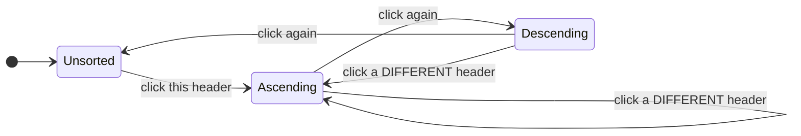

# Sorting

Sorting is always server-side. A header click produces the next `QueryState`;
the ordering itself is an `ORDER BY` on whatever holds your data.

- [The cycle](#the-cycle)
- [Which headers are sortable](#which-headers-are-sortable)
- [The wire format](#the-wire-format)
- [Setting an explicit sort](#setting-an-explicit-sort)
- [Multi-column sort](#multi-column-sort)
- [Server side](#server-side)
- [Accessibility](#accessibility)

Why there is no client-side sort at all is argued in
[Concepts](../concepts.md#why-there-is-no-client-side-sorting).

## The cycle

Clicking a sortable header advances one step:



Sorting a **different** column always starts at `asc`, whatever the previous
column's direction was. The whole rule is one reducer:

```ts
export function withToggledSort(query: QueryState, field: string): QueryState {
  const current = primarySort(query);
  let sort: SortSpec[];

  if (current?.field !== field) {
    sort = [{ field, dir: "asc" }];
  } else if (current.dir === "asc") {
    sort = [{ field, dir: "desc" }];
  } else {
    sort = [];
  }

  return { ...query, sort, page: 1 };
}
```

Note `page: 1`. Changing the order changes which rows land on page 3, so
staying on page 3 would show an arbitrary slice of a different ordering.

Sort icons follow the state: idle is an up-down arrow at 40 % opacity, active is
an up (asc) or down (desc) arrow in `--nxg-primary`.

## Which headers are sortable

```ts
export function isSortable<TData, TRender>(col: NexGridColumn<TData, TRender>): boolean {
  return col.enableSorting !== false && getColumnId(col) !== "" && !isStructuralColumn(col);
}
```

Sorting is **on by default** (the TanStack convention). Turn it off for columns
your endpoint cannot order by — a header that produces no change is worse than a
header with no affordance:

```ts
const columns: NexGridReactColumn<Student>[] = [
  { accessorKey: "name", header: "Name" },                        // sortable
  { accessorKey: "email", header: "Email", enableSorting: false }, // not
  { id: "actions", header: "", meta: { align: "right", width: 64 } }, // structural: never
];
```

Structural columns (`select`, `actions`) and columns with no resolvable id are
never sortable, regardless of `enableSorting`.

```cshtml
@* ASP.NET Core *@
<nex-grid-column field="email" header="Email" sortable="false" />
```

Keep the column set and the server allowlist in step: a column marked sortable
whose field is not registered with `Sortable(...)` gets a working header that
silently changes nothing.

## The wire format

```text
GET /api/students?page=1&pageSize=25&sort=name:asc
GET /api/students?page=1&pageSize=25&sort=score:desc&sort=name:asc
```

`sort` is a repeatable `field:dir` token; the first is primary. Parsing degrades
rather than failing:

| Token | Parsed as |
| --- | --- |
| `name:asc` | `{ field: "name", dir: "asc" }` |
| `name:desc` | `{ field: "name", dir: "desc" }` |
| `name` | `{ field: "name", dir: "asc" }` |
| `name:sideways` | `{ field: "name", dir: "asc" }` |
| `:desc` | dropped |
| `a:b:desc` | `{ field: "a:b", dir: "desc" }` — the field is everything before the **last** colon |

`NexGrid.AspNetCore` parses the token exactly this way, so a URL means the same
thing on the client and on the server.

## Setting an explicit sort

`withToggledSort` is for header clicks. When you want a specific direction — an
initial sort, a "newest first" button, a saved view — use `withSort`:

```ts
import { defaultQuery, withSort, type QueryState } from "@nexgrid/core";

// Newest first on first paint.
const initial: QueryState = withSort(defaultQuery(), "createdAt", "desc");
// { page: 1, pageSize: 10, sort: [{ field: "createdAt", dir: "desc" }] }
```

```tsx
"use client";

import { useState } from "react";
import { NexGrid, defaultQuery, withSort, type QueryState } from "@nexgrid/react";

export function StudentsGrid() {
  const [query, setQuery] = useState<QueryState>(() =>
    withSort(defaultQuery(), "createdAt", "desc"),
  );
  // …fetch on `query`, then:
  return (
    <>
      <button type="button" onClick={() => setQuery((q) => withSort(q, "score", "desc"))}>
        Top scores first
      </button>
      {/* <NexGrid query={query} onQueryChange={setQuery} … /> */}
    </>
  );
}
```

In the ASP.NET Core Tag Helper the initial sort is one attribute:

```cshtml
<nex-grid caption="Students" endpoint="/api/students" sort="createdAt:desc">
    <nex-grid-column field="name" header="Name" />
    <nex-grid-column field="createdAt" header="Enrolled" />
</nex-grid>
```

Reading the primary sort back, for a "sorted by" label or an analytics event:

```ts
import { primarySort } from "@nexgrid/core";

const sort = primarySort(query);   // SortSpec | undefined
const label = sort ? `${sort.field} (${sort.dir})` : "default order";
```

## Multi-column sort

`QueryState.sort` is an ordered array, and both `serializeQuery` and
`parseQuery` round-trip every entry — so the wire format supports as many sorts
as you want, first being primary.

The **header UI** drives a single sort: `withToggledSort` replaces the array.
Multi-sort is therefore something you compose yourself and hand in:

```ts
import { type QueryState } from "@nexgrid/core";

const query: QueryState = {
  page: 1,
  pageSize: 25,
  sort: [
    { field: "status", dir: "asc" },
    { field: "createdAt", dir: "desc" },
  ],
};
// ?page=1&pageSize=25&sort=status:asc&sort=createdAt:desc
```

The grid renders the sort indicator for the **primary** sort only. The next
header click collapses the array back to one entry.

## Server side

### ASP.NET Core

```csharp
db.Students
    .AsNoTracking()
    .ToPagedResponseAsync(query, options => options
        .Sortable(s => s.Name, s => s.Score, s => s.CreatedAt)
        .Sortable("student", s => s.Name)          // explicit key for a computed column id
        .DefaultSort(s => s.CreatedAt, SortDirection.Descending), ct);
```

Keys are matched case-insensitively against the member name, so `s => s.CreatedAt`
answers the browser's `?sort=createdAt:desc`. A field that is not registered is
dropped — no error, no reflection, no leak.

> **Always set a `DefaultSort`.** `Skip`/`Take` over an unordered SQL query has
> no defined row order: a user can page forward and see the same record twice
> and never see another. One line fixes it.

### Anywhere else

Resolve the field through a map you wrote. Never index a data structure with the
raw string:

```ts
import { parseQuery } from "@nexgrid/core";

const SORTABLE = {
  name: "name",
  score: "score",
  createdAt: "created_at",
} as const;

const query = parseQuery(new URL(request.url).searchParams);
const spec = query.sort[0];
const column = spec && spec.field in SORTABLE
  ? SORTABLE[spec.field as keyof typeof SORTABLE]
  : "created_at";                 // a default order is not optional
const direction = spec?.dir === "desc" ? "DESC" : "ASC";
```

Full worked endpoints: [Server integration](../server-integration.md).

## Accessibility

- A sortable `th` carries `aria-sort="ascending" | "descending" | "none"`.
- Sortable headers are focusable and activate on `Enter` or `Space`.
- The sort icon is `aria-hidden` — state is conveyed by `aria-sort`, not by the
  glyph.

## Related

- [Columns](../columns.md) — `enableSorting`, ids, structural columns
- [Pagination](pagination.md) — why a sort change resets to page 1
- [`@nexgrid/core` API](../api/core.md) — `withToggledSort`, `withSort`, `primarySort`
