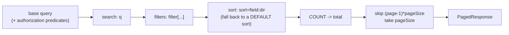

# Server integration

Implement two things — a query string in, a `PagedResponse` out — and every
NexGrid adapter works against your endpoint with no glue code.

- [The wire format](#the-wire-format)
- [Parsing rules](#parsing-rules)
- [The response](#the-response)
- [Order of operations](#order-of-operations)
- [The allowlist](#the-allowlist)
- [ASP.NET Core](#aspnet-core)
- [Node / Express](#node--express)
- [Next.js route handlers](#nextjs-route-handlers)
- [Checklist](#checklist)

## The wire format

```text
GET /api/students?page=2&pageSize=25&sort=name:asc&q=smith&filter[status]=Active
```

| Parameter | Cardinality | Meaning |
| --- | --- | --- |
| `page` | 1 | 1-based page number. Always emitted. |
| `pageSize` | 1 | Rows per page: `10`, `25`, `50` or `100`. Always emitted. |
| `sort` | 0..n | `field:dir` token, `dir` ∈ `asc` \| `desc`. Repeatable; the first is primary. |
| `q` | 0..1 | Global search text. Omitted entirely when empty — never sent as `q=`. |
| `filter[<field>]` | 0..n | One per-column filter. |

The client side is `serializeQuery` / `buildQueryUrl`:

```ts
export function toSearchParams(query: QueryState): URLSearchParams;
export function serializeQuery(query: QueryState): string;          // no leading "?"
export function parseQuery(input: string | URLSearchParams): QueryState;
export function buildQueryUrl(endpoint: string, query: QueryState): string;
```

`buildQueryUrl` preserves parameters already on the endpoint, so a scoped URL
keeps working:

```ts
import { buildQueryUrl, defaultQuery, withSearch } from "@nexgrid/core";

const query = withSearch(defaultQuery(), "smith");
buildQueryUrl("/api/students?cohort=2026", query);
// "/api/students?cohort=2026&page=1&pageSize=10&q=smith"
```

`page` and `pageSize` are always present, so the query string is never empty and
the `?`/`&` decision is unambiguous.

## Parsing rules

`parseQuery` is written to **degrade, never reject**. A hand-edited URL must
produce a usable grid, not a 400 — the address bar is a user interface, and a
grid that 500s on `?page=abc` is a grid that 500s in a bug report.

| Input | Result |
| --- | --- |
| `?page=0`, `?page=-3`, `?page=abc`, missing | `page = 1` |
| `?page=12abc` | `page = 12` (JavaScript `parseInt` semantics) |
| `?pageSize=7`, `?pageSize=100000`, missing | `pageSize = 10` (`DEFAULT_PAGE_SIZE`) |
| `?sort=name` | `{ field: "name", dir: "asc" }` |
| `?sort=name:sideways` | `{ field: "name", dir: "asc" }` |
| `?sort=:desc` | dropped |
| `?sort=a:b:desc` | `{ field: "a:b", dir: "desc" }` — the field is everything before the **last** colon |
| `?q=` | `q` absent |
| `?filter[status]=` | present in `filter` with an empty value |

`NexGrid.AspNetCore`'s `NexGridQuery` mirrors these rules exactly — including
the `parseInt` prefix behaviour — so a URL means the same thing on both sides of
the wire.

Degrading is not the same as trusting. A parsed `sort.field` is still an
arbitrary string from the network; see [The allowlist](#the-allowlist).

## The response

```ts
export interface PagedResponse<T> {
  items: T[];
  page: number;
  pageSize: number;
  total: number;
  totalPages: number;
}
```

```json
{
  "items": [
    { "id": 1, "name": "Ada Lovelace", "email": "ada@example.com", "status": "Active" }
  ],
  "page": 2,
  "pageSize": 25,
  "total": 1284,
  "totalPages": 52
}
```

Four rules:

1. **`items` is exactly one page.** Never the full dataset.
2. **`total` is the full *filtered* count.** Not `items.length`. It drives the
   pager, the record range, and the export's "do I already have everything?"
   decision. Returning `items.length` is the most common integration bug: the
   pager collapses to one page and the export silently ships 10 of 4,000 rows.
3. **Property names are camelCase.** Column ids in `sort=` and `filter[]` are
   the JSON property names your endpoint returns (`createdAt`, not `CreatedAt`).
4. **`totalPages` is derived** — `max(1, ceil(total / pageSize))` — and the
   adapters recompute it with `totalPagesFor` anyway, so a disagreement is
   harmless but confusing.

The grid reads only `items` and `total`. `page`, `pageSize` and `totalPages` are
there for HTTP caches, logs, and clients that are not the grid.

## Order of operations



Two invariants:

- **Count and page must share the same predicates.** Counting the unfiltered
  table and paging the filtered one produces a pager that promises rows that do
  not exist.
- **Order before you page.** `OFFSET`/`FETCH` over an unordered query has no
  defined row order: a user can page forward, see the same record twice, and
  never see another. Always have a fallback sort.

## The allowlist

The grid sends the column ids it was configured with. The query string is not a
grid — it is whatever anyone types into the address bar:

```text
?sort=PasswordHash:asc
?filter[IsDeleted]=false
?sort=Owner.Organisation.BillingEmail:desc
```

A server that resolved those names by reflection would happily order by a
password hash and let an attacker read it one binary-search page at a time.

So: **never turn a client string into a member access.** Map it through a
structure the server wrote, and drop anything not in it. That is one `if` in
every language:

```csharp
if (!options.SortableMembers.TryGetValue(spec.Field, out var selector))
{
    continue;   // not allowlisted: dropped, never reflected
}
```

The allowlist is **not authorization**. Filter by tenant, owner or role *before*
the grid's paging runs — the grid pages whatever query you hand it.

## ASP.NET Core

`NexGrid.AspNetCore` implements everything above. Install it and there is
nothing to register in `Program.cs`:

```bash
dotnet add package NexGrid.AspNetCore
```

### Controller

```csharp
using Microsoft.AspNetCore.Mvc;
using Microsoft.EntityFrameworkCore;
using NexGrid.AspNetCore;

namespace MyApp.Controllers;

public sealed class Student
{
    public int Id { get; set; }
    public int TenantId { get; set; }
    public string Name { get; set; } = "";
    public string Email { get; set; } = "";
    public string Status { get; set; } = "";
    public int Score { get; set; }
    public DateTime CreatedAt { get; set; }
    public string? InternalNotes { get; set; }   // never exposed: not projected
}

public sealed record StudentRow(
    int Id, string Name, string Email, string Status, int Score, DateTime CreatedAt);

[ApiController]
[Route("api/students")]
public sealed class StudentsController(AppDbContext db) : ControllerBase
{
    [HttpGet]
    public Task<PagedResponse<StudentRow>> Get(NexGridQuery query, CancellationToken ct) =>
        db.Students
            .AsNoTracking()
            .Where(s => s.TenantId == TenantId)          // authorization first, always
            .Select(s => new StudentRow(
                s.Id, s.Name, s.Email, s.Status, s.Score, s.CreatedAt))
            .ToPagedResponseAsync(query, options => options
                .Sortable(s => s.Name, s => s.Score, s => s.CreatedAt)
                .Searchable(s => s.Name, s => s.Email)
                .Filterable("status", s => s.Status)
                .DefaultSort(s => s.CreatedAt, SortDirection.Descending), ct);

    private int TenantId =>
        int.Parse(User.FindFirst("tenant_id")!.Value);
}
```

`NexGridQuery` carries `[ModelBinder(typeof(NexGridQueryModelBinder))]`, so an
undecorated parameter binds. `[FromQuery] NexGridQuery query` works identically —
the attribute only names the binding source, which the binder reads straight off
`HttpContext.Request.Query`.

> **Project before you page.** `.Select(...)` into a row type keeps columns the
> UI never shows — `InternalNotes`, `PasswordHash` — out of the SQL entirely. The
> allowlist already prevents them being sorted or filtered on; projecting keeps
> them from being *read*.

Two round trips reach the database, and neither materialises a row the user is
not looking at:

```sql
SELECT COUNT(*) FROM [Students] WHERE [TenantId] = @tenant AND ([Name] LIKE @q OR [Email] LIKE @q);

SELECT [Id], [Name], [Email], [Status], [Score], [CreatedAt] FROM [Students]
WHERE [TenantId] = @tenant AND ([Name] LIKE @q OR [Email] LIKE @q)
ORDER BY [CreatedAt] DESC
OFFSET @skip ROWS FETCH NEXT @take ROWS ONLY;
```

`@q` and `@take` are **parameters**: values from the query string are lifted into
the expression tree the way a C# closure is, not baked in as constants, so the
database reuses one query plan for every search term.

### Minimal API

`NexGridQuery` implements the `BindAsync(HttpContext)` hook minimal APIs look for:

```csharp
using Microsoft.EntityFrameworkCore;
using NexGrid.AspNetCore;

var builder = WebApplication.CreateBuilder(args);
builder.Services.AddDbContext<AppDbContext>(o => o.UseSqlServer(
    builder.Configuration.GetConnectionString("Default")));
builder.Services.AddRazorPages();

var app = builder.Build();
app.UseStaticFiles();       // serves _content/NexGrid.AspNetCore/*
app.MapRazorPages();

app.MapGet("/api/students", (NexGridQuery query, AppDbContext db, CancellationToken ct) =>
    db.Students
        .AsNoTracking()
        .ToPagedResponseAsync(query, options => options
            .Sortable(s => s.Name, s => s.Score, s => s.CreatedAt)
            .Searchable(s => s.Name, s => s.Email)
            .Filterable("status", s => s.Status)
            .DefaultSort(s => s.CreatedAt, SortDirection.Descending), ct));

app.Run();
```

### Razor Pages, middleware, background jobs

Call the parser yourself:

```csharp
using Microsoft.AspNetCore.Mvc.RazorPages;
using Microsoft.EntityFrameworkCore;
using NexGrid.AspNetCore;

public sealed class StudentsModel(AppDbContext db) : PageModel
{
    public PagedResponse<Student> Result { get; private set; } = new();

    public async Task OnGetAsync(CancellationToken ct)
    {
        var query = NexGridQuery.Parse(Request.Query);
        Result = await db.Students
            .AsNoTracking()
            .ToPagedResponseAsync(query, options => options
                .Sortable(s => s.Name, s => s.CreatedAt)
                .Searchable(s => s.Name, s => s.Email)
                .DefaultSort(s => s.CreatedAt, SortDirection.Descending), ct);
    }
}
```

`NexGridQuery.Parse(string)` takes a raw query string (with or without the
leading `?`), which is convenient in tests.

### Allowlist details

- **Keys match case-insensitively** against the member name, so
  `s => s.CreatedAt` answers `?sort=createdAt:desc`.
- **Explicit keys** cover computed columns and ids that differ from the member:
  `Sortable("student", s => s.Name)`, `Filterable("state", s => s.Status)`.
- **Filter values are converted, never interpreted.** `?filter[score]=banana`
  drops the filter rather than failing the request. `string`, enums, `bool`,
  numeric types, `Guid`, `DateTime`, `DateTimeOffset`, `DateOnly` and `TimeOnly`
  are supported.
- **Nothing is allowed by default.** `ToPagedResponse(query)` with no `configure`
  delegate ignores every sort, search and filter and just pages.
- **`Searchable` OR's `Contains`** across the registered string members.

Full member list: [`NexGrid.AspNetCore` API](api/aspnet.md).

## Node / Express

`parseQuery` gives you the same parsing rules, and `PagedResponse<T>` the same
shape. Everything else is your data layer.

Express's default query parser turns `filter[status]=Active` into a nested
object, which is *not* what `parseQuery` reads — so hand it the raw query string
instead:

```ts
// server.ts
import express from "express";
import { parseQuery, type PagedResponse, type QueryState } from "@nexgrid/core";

import { pool } from "./db.js";   // a `pg` Pool

interface Student {
  id: number;
  name: string;
  email: string;
  status: string;
  score: number;
  createdAt: string;
}

/** Column id -> SQL column. Nothing else may be sorted or filtered. */
const SORTABLE: Record<string, string> = {
  name: "name",
  score: "score",
  createdAt: "created_at",
};

const FILTERABLE: Record<string, string> = {
  status: "status",
};

const SEARCHABLE = ["name", "email"];

function buildWhere(query: QueryState, tenantId: number) {
  const clauses = ["tenant_id = $1"];
  const values: unknown[] = [tenantId];

  if (query.q) {
    values.push(`%${query.q}%`);
    const placeholder = `$${values.length}`;
    clauses.push(`(${SEARCHABLE.map((c) => `${c} ILIKE ${placeholder}`).join(" OR ")})`);
  }

  for (const [field, value] of Object.entries(query.filter ?? {})) {
    const column = FILTERABLE[field];
    if (!column || value === "") continue;      // not allowlisted: dropped
    values.push(value);
    clauses.push(`${column} = $${values.length}`);
  }

  return { where: `WHERE ${clauses.join(" AND ")}`, values };
}

function buildOrderBy(query: QueryState): string {
  const spec = query.sort[0];
  const column = spec ? SORTABLE[spec.field] : undefined;
  if (!column) return "ORDER BY created_at DESC";   // a default order is not optional
  return `ORDER BY ${column} ${spec!.dir === "desc" ? "DESC" : "ASC"}`;
}

const app = express();

app.get("/api/students", async (req, res) => {
  // Use the RAW query string: Express's parser would turn filter[status]
  // into a nested object, which parseQuery does not read.
  const raw = req.originalUrl.slice(req.originalUrl.indexOf("?") + 1);
  const query = parseQuery(raw);

  const tenantId = Number(res.locals.tenantId);     // from your auth middleware
  const { where, values } = buildWhere(query, tenantId);

  const countResult = await pool.query<{ count: string }>(
    `SELECT COUNT(*)::text AS count FROM students ${where}`,
    values,
  );
  const total = Number(countResult.rows[0]?.count ?? 0);

  const offset = (query.page - 1) * query.pageSize;
  const rows = await pool.query<Student>(
    `SELECT id, name, email, status, score, created_at AS "createdAt"
       FROM students ${where} ${buildOrderBy(query)}
      LIMIT $${values.length + 1} OFFSET $${values.length + 2}`,
    [...values, query.pageSize, offset],
  );

  const body: PagedResponse<Student> = {
    items: rows.rows,
    page: query.page,
    pageSize: query.pageSize,
    total,
    totalPages: Math.max(1, Math.ceil(total / query.pageSize)),
  };

  res.json(body);
});

app.listen(3000);
```

Three details that matter:

- The **raw** query string, so `filter[status]` survives.
- Column names come out of `SORTABLE` / `FILTERABLE`, never out of the request.
  Interpolating `spec.field` into SQL is the injection.
- `ORDER BY` has a fallback, and the same `where` feeds both the count and the
  page.

Prefer a query builder? The same shape, with Kysely:

```ts
import { parseQuery, type PagedResponse } from "@nexgrid/core";
import { db } from "./db.js";   // Kysely<Database>

export async function listStudents(rawQueryString: string, tenantId: number) {
  const query = parseQuery(rawQueryString);

  let base = db.selectFrom("students").where("tenant_id", "=", tenantId);

  if (query.q) {
    const needle = `%${query.q}%`;
    base = base.where((eb) =>
      eb.or([eb("name", "ilike", needle), eb("email", "ilike", needle)]),
    );
  }

  const status = query.filter?.["status"];
  if (status) base = base.where("status", "=", status);

  const { count } = await base
    .select((eb) => eb.fn.countAll<number>().as("count"))
    .executeTakeFirstOrThrow();

  const spec = query.sort[0];
  const column =
    spec?.field === "name" ? "name" : spec?.field === "score" ? "score" : "created_at";
  const direction = spec?.dir === "desc" ? "desc" : "asc";

  const items = await base
    .selectAll()
    .orderBy(column, spec ? direction : "desc")
    .limit(query.pageSize)
    .offset((query.page - 1) * query.pageSize)
    .execute();

  const body: PagedResponse<(typeof items)[number]> = {
    items,
    page: query.page,
    pageSize: query.pageSize,
    total: Number(count),
    totalPages: Math.max(1, Math.ceil(Number(count) / query.pageSize)),
  };
  return body;
}
```

## Next.js route handlers

`request.nextUrl.searchParams` is a `URLSearchParams`, which `parseQuery`
accepts directly — and it preserves `filter[status]` verbatim.

```ts
// app/api/students/route.ts
import { NextResponse, type NextRequest } from "next/server";
import { parseQuery, type PagedResponse, type QueryState } from "@nexgrid/core";
import { and, asc, count, desc, eq, ilike, or, type SQL } from "drizzle-orm";

import { db } from "@/lib/db";
import { students } from "@/lib/schema";
import { requireTenantId } from "@/lib/auth";

export const dynamic = "force-dynamic";   // the response depends on the query string

const SORTABLE = {
  name: students.name,
  score: students.score,
  createdAt: students.createdAt,
} as const;

function orderBy(query: QueryState) {
  const spec = query.sort[0];
  const column = spec && spec.field in SORTABLE
    ? SORTABLE[spec.field as keyof typeof SORTABLE]
    : students.createdAt;                       // always order by something
  return spec?.dir === "desc" ? desc(column) : asc(column);
}

export async function GET(request: NextRequest) {
  const query = parseQuery(request.nextUrl.searchParams);
  const tenantId = await requireTenantId();

  const predicates: SQL[] = [eq(students.tenantId, tenantId)];

  if (query.q) {
    const needle = `%${query.q}%`;
    const match = or(ilike(students.name, needle), ilike(students.email, needle));
    if (match) predicates.push(match);
  }

  const status = query.filter?.["status"];
  if (status) predicates.push(eq(students.status, status));

  const where = and(...predicates);

  const [{ value: total }] = await db
    .select({ value: count() })
    .from(students)
    .where(where);

  const items = await db
    .select()
    .from(students)
    .where(where)
    .orderBy(orderBy(query))
    .limit(query.pageSize)
    .offset((query.page - 1) * query.pageSize);

  const body: PagedResponse<(typeof items)[number]> = {
    items,
    page: query.page,
    pageSize: query.pageSize,
    total,
    totalPages: Math.max(1, Math.ceil(total / query.pageSize)),
  };

  return NextResponse.json(body);
}
```

Notes for the App Router specifically:

- **`export const dynamic = "force-dynamic"`** (or a `revalidate` value). The
  response is a function of the query string; a statically cached handler would
  serve page 1 forever.
- **The grid is a client component** (`"use client"`), and `columns` contains
  functions — define the column array in the client file, not in the server
  page. See [Getting started](getting-started.md#nextjs-app-router).
- **Server Actions are not a substitute.** The grid issues a `GET` for a page of
  data; keep the list endpoint a route handler.

### Pages Router

```ts
// pages/api/students.ts
import type { NextApiRequest, NextApiResponse } from "next";
import { parseQuery, type PagedResponse } from "@nexgrid/core";

import { listStudents } from "@/lib/students";

export default async function handler(
  req: NextApiRequest,
  res: NextApiResponse<PagedResponse<Student>>,
) {
  // `req.url` keeps filter[status] intact; req.query would reshape it.
  const raw = req.url?.slice(req.url.indexOf("?") + 1) ?? "";
  const query = parseQuery(raw);

  res.status(200).json(await listStudents(query));
}
```

---

## OData v4 Integration

NexGrid includes built-in adapters for **OData v4** (`toODataParams`, `buildODataUrl`, and `fromODataResponse`).

### Client Setup (React / Angular / Vanilla)

```tsx
import { useEffect, useState } from "react";
import { NexGrid } from "@nexgrid/react";
import {
  defaultQuery,
  buildODataUrl,
  fromODataResponse,
  type QueryState,
  type PagedResponse,
} from "@nexgrid/core";

export function ODataGrid() {
  const [query, setQuery] = useState<QueryState>(defaultQuery());
  const [page, setPage] = useState<PagedResponse<Student>>();
  const [loading, setLoading] = useState(true);

  useEffect(() => {
    setLoading(true);

    // Converts QueryState -> $top, $skip, $orderby, $filter, $count=true
    const url = buildODataUrl("https://api.example.com/odata/Students", query, {
      searchableFields: ["Name", "Email"],
      fieldMap: { status: "Status", createdAt: "CreatedOn" },
    });

    fetch(url)
      .then((r) => r.json())
      .then((odataJson) => setPage(fromODataResponse(odataJson, query)))
      .finally(() => setLoading(false));
  }, [query]);

  return (
    <NexGrid
      caption="OData Students"
      columns={columns}
      data={page?.items ?? []}
      total={page?.total ?? 0}
      query={query}
      onQueryChange={setQuery}
      isLoading={loading}
    />
  );
}
```

### Backend (ASP.NET Core OData)

```csharp
[HttpGet]
[EnableQuery(PageSize = 100)]
public IQueryable<Student> Get()
{
    return _db.Students.AsNoTracking();
}
```

---

## gRPC / Connect-RPC Integration

For high-throughput microservices using Protobuf and gRPC or Connect-RPC:

### 1. Protobuf Definition (`students.proto`)

```protobuf
syntax = "proto3";

package students.v1;

message QueryRequest {
  int32 page = 1;
  int32 page_size = 2;
  repeated string sort = 3;       // e.g. ["name:asc", "created_at:desc"]
  string search = 4;
  map<string, string> filter = 5; // e.g. {"status": "Active"}
}

message StudentItem {
  string id = 1;
  string name = 2;
  string email = 3;
  string status = 4;
}

message QueryResponse {
  repeated StudentItem items = 1;
  int32 total = 2;
  int32 page = 3;
  int32 page_size = 4;
  int32 total_pages = 5;
}

service StudentService {
  rpc ListStudents (QueryRequest) returns (QueryResponse);
}
```

### 2. Client Setup (TypeScript with `@connectrpc/connect` or `grpc-web`)

```tsx
import { useEffect, useState } from "react";
import { NexGrid } from "@nexgrid/react";
import { defaultQuery, type QueryState, type PagedResponse } from "@nexgrid/core";
import { createPromiseClient } from "@connectrpc/connect";
import { StudentService } from "./gen/students_connect";

export function GrpcGrid({ transport }: { transport: any }) {
  const [query, setQuery] = useState<QueryState>(defaultQuery());
  const [page, setPage] = useState<PagedResponse<Student>>();
  const [loading, setLoading] = useState(true);

  const client = createPromiseClient(StudentService, transport);

  useEffect(() => {
    setLoading(true);

    client.listStudents({
      page: query.page,
      pageSize: query.pageSize,
      sort: query.sort.map((s) => `${s.field}:${s.dir}`),
      search: query.q || "",
      filter: query.filter || {},
    })
    .then((res) => {
      setPage({
        items: res.items as Student[],
        page: res.page,
        pageSize: res.pageSize,
        total: res.total,
        totalPages: res.totalPages,
      });
    })
    .finally(() => setLoading(false));
  }, [query]);

  return (
    <NexGrid
      caption="gRPC Students"
      columns={columns}
      data={page?.items ?? []}
      total={page?.total ?? 0}
      query={query}
      onQueryChange={setQuery}
      isLoading={loading}
    />
  );
}
```

---

## GraphQL Integration

Connecting NexGrid to GraphQL APIs (Apollo, Relay, Hot Chocolate):

```tsx
import { gql, useQuery } from "@apollo/client";
import { useState } from "react";
import { NexGrid } from "@nexgrid/react";
import { defaultQuery, type QueryState } from "@nexgrid/core";

const GET_STUDENTS = gql`
  query GetStudents($page: Int!, $pageSize: Int!, $sort: [String!], $q: String, $status: String) {
    students(page: $page, pageSize: $pageSize, sort: $sort, q: $q, status: $status) {
      items { id name email status }
      total
      page
      pageSize
      totalPages
    }
  }
`;

export function GraphQLGrid() {
  const [query, setQuery] = useState<QueryState>(defaultQuery());

  const { data, loading } = useQuery(GET_STUDENTS, {
    variables: {
      page: query.page,
      pageSize: query.pageSize,
      sort: query.sort.map((s) => `${s.field}:${s.dir}`),
      q: query.q || null,
      status: query.filter?.status || null,
    },
  });

  const page = data?.students;

  return (
    <NexGrid
      caption="GraphQL Students"
      columns={columns}
      data={page?.items ?? []}
      total={page?.total ?? 0}
      query={query}
      onQueryChange={setQuery}
      isLoading={loading}
    />
  );
}
```

---

## Checklist

- [ ] `page`, `pageSize`, repeatable `sort`, `q` and `filter[...]` are read from
      the query string, and malformed values degrade instead of erroring.
- [ ] `pageSize` is coerced to `10 | 25 | 50 | 100`.
- [ ] Sortable, searchable and filterable fields come from an **allowlist you
      wrote**; unknown fields are dropped silently.
- [ ] Authorization predicates are applied **before** search, filter, sort and
      paging.
- [ ] The count and the page share the same predicates.
- [ ] There is always an `ORDER BY`, even when the request carries no sort.
- [ ] The response is `{ items, page, pageSize, total, totalPages }` with
      camelCase property names, and `total` is the full filtered count.
- [ ] Rows are projected to what the UI shows — no internal columns riding along.
- [ ] The endpoint is safe to call at `pageSize=100` repeatedly: exports walk it
      up to 20 times. See [Export](features/export.md).

## Related

- [Concepts](concepts.md) — why the contract looks like this
- [Sorting](features/sorting.md) · [Search](features/search.md) · [Pagination](features/pagination.md)
- [`NexGrid.AspNetCore` API](api/aspnet.md) · [`@nexgrid/core` API](api/core.md)

