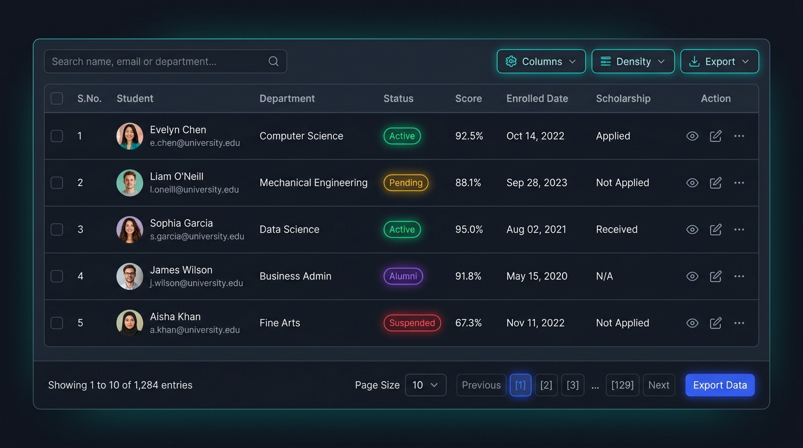

# Theming

Every colour and shape in the stylesheet reads a CSS custom property. You re-skin
the grid by overriding tokens — no class overrides, no `!important`.

- [Loading the stylesheet](#loading-the-stylesheet)
- [The tokens](#the-tokens)
- [Where to put your overrides](#where-to-put-your-overrides)
- [Dark mode](#dark-mode)
- [Worked example: a violet brand theme](#worked-example-a-violet-brand-theme)
- [Worked example: following an app-wide theme switch](#worked-example-following-an-app-wide-theme-switch)
- [Worked example: a dense, borderless report table](#worked-example-a-dense-borderless-report-table)
- [Styling beyond tokens](#styling-beyond-tokens)
- [Class reference](#class-reference)

## Loading the stylesheet

One global file, shared by all four renderers.

| Platform | How |
| --- | --- |
| React / Next.js | `import "@nexgrid/react/styles.css";` |
| Angular | add `node_modules/@nexgrid/angular/styles.css` to `angular.json` → `styles` |
| Vanilla (bundler) | `import "@nexgrid/vanilla/styles.css";` |
| Vanilla (script tag) | `<link rel="stylesheet" href=".../dist/tablex.css">` |
| ASP.NET Core | `<link rel="stylesheet" href="@TableXAssets.StylesheetPath" />` |
| From CSS anywhere | `@import "@nexgrid/core/styles.css";` |

It must be **global**. In Angular, component styles are scoped by emulated
view encapsulation and will not reach the grid's markup — putting the import in
a component's `styles` array silently does nothing.

## The tokens

All of them are declared on `.tbx-root`. These are the light-mode defaults, as
shipped:

| Token | Default | Used for |
| --- | --- | --- |
| `--tbx-font` | `ui-sans-serif, system-ui, -apple-system, "Segoe UI", Roboto, "Helvetica Neue", Arial, sans-serif` | Every string in the grid. |
| `--tbx-font-mono` | `ui-monospace, SFMono-Regular, Menlo, Consolas, monospace` | Serial numbers (table cell and card head). |
| `--tbx-bg` | `#ffffff` | Input, button, select, pager and checkbox backgrounds. |
| `--tbx-card` | `#ffffff` | Toolbar, table, footer, menu and card surfaces. |
| `--tbx-card-2` | `#f8fafc` | The table header band. |
| `--tbx-border` | `#e2e8f0` | Every border, divider and row rule. |
| `--tbx-fg` | `#0f172a` | Primary text. |
| `--tbx-muted` | `#f1f5f9` | Hover fills, range chips. |
| `--tbx-muted-fg` | `#64748b` | Secondary text: header labels, placeholders, ellipsis, states. |
| `--tbx-primary` | `#2563eb` | Accent: sort icons, current page, selection tint, focus, search icon. |
| `--tbx-primary-fg` | `#ffffff` | Text on primary fills (current page button, checkmark). |
| `--tbx-danger` | `#dc2626` | Destructive accents. |
| `--tbx-radius` | `12px` | Panel corners: toolbar, table wrap, footer, cards. |
| `--tbx-radius-sm` | `8px` | Control corners: buttons, inputs, menus, pager. |
| `--tbx-shadow` | `0 1px 2px 0 rgb(0 0 0 / 0.05)` | Elevation on panels and controls. |
| `--tbx-focus-ring` | `0 0 0 2px color-mix(in srgb, var(--tbx-primary) 35%, transparent)` | The focus ring on every focusable control. |

Two colours are **not** tokenised, because they identify a file format rather
than the brand: the Excel menu icon (`.tbx-icon--excel`, `#10b981`) and the CSV
menu icon (`.tbx-icon--csv`, `#06b6d4`). Override those classes directly if you
need to.

Several rules derive shades from `--tbx-primary` with `color-mix`, so setting
one accent token updates the selection tint, the export button's border, the
range total chip and the focus ring together.

## Where to put your overrides

Anywhere the cascade reaches `.tbx-root`. Highest to lowest reach:

```css
/* 1. Every grid in the app. */
.tbx-root {
  --tbx-primary: #7c3aed;
  --tbx-radius: 8px;
}

/* 2. One grid, via className / grid-class / a class on <table-x>. */
.tbx-root.students-grid {
  --tbx-primary: #0f766e;
}

/* 3. A section of the app. */
.admin-area .tbx-root {
  --tbx-font: "Inter", system-ui, sans-serif;
}
```

```tsx
<TableX className="students-grid" {...props} />
```

```html
<table-x class="students-grid" caption="Students" …/>
```

```js
createTableX(document.getElementById("grid"), {
  caption: "Students",
  endpoint: "/api/students",
  columns,
  className: "students-grid",
});
```

```cshtml
<table-x caption="Students" endpoint="/api/students" grid-class="students-grid">…</table-x>
```

On `<table-x>` (Angular) the **host element itself** carries `.tbx-root`, so a
plain `class` attribute lands on the grid root. In the ASP.NET Tag Helper the
element's own `class` stays on the mount point and `grid-class` targets the
root — they are different elements.

## Dark mode

Dark mode is a **class**, not a media query, so it can follow whatever your app
already uses. The `theme` prop is a convenience that adds it:

| Value | Adds | Behaviour |
| --- | --- | --- |
| `"light"` (default) | — | Always light. |
| `"dark"` | `.tbx-dark` on the root | Always dark. |
| `"auto"` | `.tbx-auto` on the root | Dark only when `prefers-color-scheme: dark`. |

### Light Mode vs. Dark Mode Preview

| ☀️ Light Mode (`theme="light"`) | 🌙 Dark Mode (`theme="dark"`) |
| :---: | :---: |
|  |  |

```tsx
<TableX theme="dark" {...props} />
<TableX theme="auto" {...props} />
```

```html
<table-x theme="dark" …/>
<table-x [theme]="'auto'" …/>
```

```js
createTableX(document.getElementById("grid"), {
  caption: "Students",
  endpoint: "/api/students",
  columns,
  theme: "auto",
});
```

```cshtml
<table-x caption="Students" endpoint="/api/students" theme="Dark">…</table-x>
```

The selectors match the class on the root **or on any ancestor**:

```css
.tbx-dark .tbx-root,
.tbx-root.tbx-dark {
  --tbx-bg: #0b1220;
  --tbx-card: #0f172a;
  --tbx-card-2: #16213a;
  --tbx-border: #253352;
  --tbx-fg: #e2e8f0;
  --tbx-muted: #1e293b;
  --tbx-muted-fg: #94a3b8;
  --tbx-primary: #3b82f6;
  --tbx-primary-fg: #ffffff;
  --tbx-shadow: 0 1px 2px 0 rgb(0 0 0 / 0.4);
}

@media (prefers-color-scheme: dark) {
  .tbx-auto .tbx-root,
  .tbx-root.tbx-auto {
    /* the same nine tokens */
  }
}
```

Note which tokens dark mode does **not** redefine: `--tbx-font`,
`--tbx-font-mono`, `--tbx-danger`, `--tbx-radius`, `--tbx-radius-sm` and
`--tbx-focus-ring`. Type, shape and the focus ring formula are shared by both
schemes, so overriding them once covers light and dark.

If your app already toggles a dark class higher up the tree, put `tbx-dark`
alongside it and leave `theme` alone:

```html
<body class="app-dark tbx-dark">
  <!-- every .tbx-root below here is dark -->
</body>
```

## Worked example: a violet brand theme

Light and dark, from one block:

```css
/* app.css — loaded AFTER the TableX stylesheet. */
.tbx-root {
  --tbx-font: "Inter", system-ui, -apple-system, sans-serif;
  --tbx-primary: #7c3aed;
  --tbx-primary-fg: #ffffff;
  --tbx-radius: 10px;
  --tbx-radius-sm: 6px;
  --tbx-border: #e4e4e7;
  --tbx-card-2: #faf5ff;
  --tbx-shadow: 0 1px 3px 0 rgb(24 24 27 / 0.08);
}

.tbx-dark .tbx-root,
.tbx-root.tbx-dark {
  --tbx-primary: #a78bfa;
  --tbx-card-2: #241b3d;
  --tbx-border: #3f3355;
}

@media (prefers-color-scheme: dark) {
  .tbx-auto .tbx-root,
  .tbx-root.tbx-auto {
    --tbx-primary: #a78bfa;
    --tbx-card-2: #241b3d;
    --tbx-border: #3f3355;
  }
}
```

Order matters: your rules must come after the grid's stylesheet, since both
target `.tbx-root` at the same specificity.

## Worked example: following an app-wide theme switch

Reuse tokens your design system already publishes, instead of hard-coding a
second palette:

```css
:root {
  --brand-surface: #ffffff;
  --brand-surface-2: #f6f7f9;
  --brand-ink: #14181f;
  --brand-ink-2: #6b7280;
  --brand-line: #e3e6ea;
  --brand-accent: #0f766e;
}

:root[data-theme="dark"] {
  --brand-surface: #101418;
  --brand-surface-2: #171d24;
  --brand-ink: #e6eaef;
  --brand-ink-2: #9aa4b2;
  --brand-line: #2a323c;
  --brand-accent: #2dd4bf;
}

/* One mapping serves both, because the brand tokens flip. */
.tbx-root {
  --tbx-bg: var(--brand-surface);
  --tbx-card: var(--brand-surface);
  --tbx-card-2: var(--brand-surface-2);
  --tbx-border: var(--brand-line);
  --tbx-fg: var(--brand-ink);
  --tbx-muted-fg: var(--brand-ink-2);
  --tbx-muted: var(--brand-surface-2);
  --tbx-primary: var(--brand-accent);
  --tbx-primary-fg: #04211d;
}
```

Leave `theme` at its default `"light"` here — the grid's own dark class would
re-declare the tokens you are mapping and undo the wiring.

## Worked example: a dense, borderless report table

```css
.tbx-root.report {
  --tbx-radius: 0px;
  --tbx-radius-sm: 2px;
  --tbx-shadow: none;
  --tbx-card-2: #ffffff;
  --tbx-border: #eceff3;
  --tbx-font: "IBM Plex Sans", system-ui, sans-serif;
  --tbx-font-mono: "IBM Plex Mono", ui-monospace, monospace;
}

/* Rules only under the header and between rows, nothing around the edges. */
.tbx-root.report .tbx-table-wrap,
.tbx-root.report .tbx-toolbar,
.tbx-root.report .tbx-footer {
  border-left: 0;
  border-right: 0;
  border-top: 0;
}

.tbx-root.report .tbx-table thead tr {
  border-bottom-width: 2px;
  text-transform: uppercase;
  letter-spacing: 0.04em;
}
```

Pair it with `density="compact"` — see [Density](features/density.md).

## Styling beyond tokens

Tokens cover colour, type and shape. For layout, target the classes directly —
they are part of the [DOM contract](adapter-spec.md) and identical on every
adapter, so a rule written once works on all four.

```css
/* Give the search box more room on wide screens. */
@media (min-width: 1280px) {
  .tbx-search {
    max-width: 480px;
  }
}

/* Freeze the first data column. */
.tbx-table .tbx-th:nth-child(2),
.tbx-table .tbx-td:nth-child(2) {
  position: sticky;
  left: 0;
  z-index: 1;
  background: var(--tbx-card);
}
```

Two habits keep this maintainable:

- **Scope to your own class** (`.tbx-root.students-grid .tbx-td`) rather than
  restyling `.tbx-td` globally.
- **Reuse `.tbx-btn`** for anything you inject through `toolbarActions` — it
  inherits the tokens and matches the built-in controls exactly.

Custom cells are your markup, so style them with your own classes. They inherit
`--tbx-*` from the root, which is the easy way to keep a status pill on-brand in
both schemes:

```css
.pill {
  display: inline-block;
  padding: 2px 8px;
  border-radius: var(--tbx-radius-sm);
  font-size: 12px;
  font-weight: 600;
  color: var(--tbx-primary);
  background: color-mix(in srgb, var(--tbx-primary) 12%, transparent);
  border: 1px solid color-mix(in srgb, var(--tbx-primary) 25%, transparent);
}
```

## Class reference

The hooks you are most likely to need. The full structural contract is
[`adapter-spec.md` §6](adapter-spec.md).

| Class | Element |
| --- | --- |
| `.tbx-root` | Grid root. Carries `data-density` and any `.tbx-dark` / `.tbx-auto`. |
| `.tbx-toolbar`, `.tbx-toolbar-group`, `.tbx-toolbar-group--end` | Toolbar and its two groups. |
| `.tbx-search`, `.tbx-search-input`, `.tbx-search-icon`, `.tbx-search-clear` | Search field. |
| `.tbx-btn`, `.tbx-btn--export` | Buttons; the export trigger. |
| `.tbx-menu-wrap`, `.tbx-menu`, `.tbx-menu--end`, `.tbx-menu-item`, `.tbx-menu-label`, `.tbx-menu-separator` | Dropdowns. |
| `.tbx-icon`, `.tbx-check`, `.tbx-icon--excel`, `.tbx-icon--csv`, `.tbx-sort-icon`, `.tbx-sort-icon--idle` | Icons. |
| `.tbx-table-wrap`, `.tbx-table` | Table (≥ 768 px). |
| `.tbx-th`, `.tbx-th--serial`, `.tbx-th--select`, `.tbx-th--sortable`, `.tbx-th-inner`, `.tbx-th-inner--center`, `.tbx-th-inner--right` | Header cells. |
| `.tbx-row`, `.tbx-row--selected`, `.tbx-row--clickable` | Body rows. |
| `.tbx-td`, `.tbx-td--serial`, `.tbx-td--select` | Body cells. |
| `.tbx-cards`, `.tbx-card`, `.tbx-card--selected`, `.tbx-card--clickable`, `.tbx-card-head`, `.tbx-card-serial`, `.tbx-card-select`, `.tbx-card-rows`, `.tbx-card-row` | Card layout (< 768 px). |
| `.tbx-state`, `.tbx-state-card`, `.tbx-state-text`, `.tbx-spinner` | Loading / empty / error. |
| `.tbx-footer`, `.tbx-range`, `.tbx-range-total`, `.tbx-selected-badge` | Footer left side. |
| `.tbx-pagination`, `.tbx-rows-per-page`, `.tbx-rows-select`, `.tbx-pager`, `.tbx-page-btn`, `.tbx-page-btn--current`, `.tbx-page-nav`, `.tbx-page-ellipsis` | Pager. |
| `.tbx-jump`, `.tbx-jump-label`, `.tbx-jump-input` | Page-jump box. |
| `.tbx-checkbox` | Selection checkboxes. |
| `.tbx-sr-only`, `.tbx-align-center`, `.tbx-align-right`, `.tbx-capitalize` | Utilities. |

## Related

- [Density](features/density.md) — `data-density` and the row-height steps
- [Responsive](features/responsive.md) — moving the 768 px breakpoint
- [Localization](localization.md) — the other half of "make it ours"
